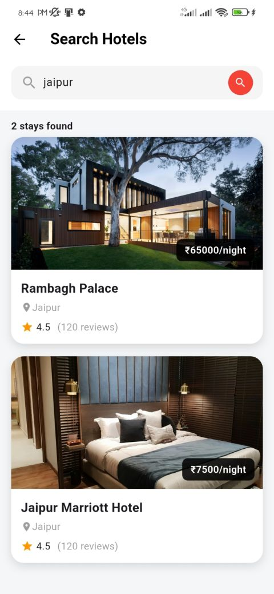

# 🏨 StayEase — Hotel Booking App

A modern full-stack hotel booking application built with **Flutter** for the mobile app and **Django REST Framework** for the backend.

StayEase allows users to browse hotels, view hotel details, register/login securely, and create and manage hotel bookings through a REST API.

> **Built with Flutter • Dart • Django • Django REST Framework • SQLite • JWT Authentication**

---

## ✨ Features

### 📱 Flutter Mobile App

- 🏨 Browse available hotels
- 🔎 Discover hotels and view details
- 📅 Hotel booking flow
- 🎫 View bookings
- 🔐 User registration and login
- 🔑 JWT-based authentication
- 📱 Modern mobile UI
- 🖼️ Custom splash and sign-in screens
- 🌐 REST API integration

### ⚙️ Backend

- 🚀 Django REST Framework API
- 🏨 Hotel CRUD APIs
- 📋 Booking CRUD APIs
- 👤 User registration API
- 🔐 JWT authentication
- 💾 SQLite database
- 🛠️ Django Admin support

---

## 📱 Screenshots

| Splash Screen | Sign In | Home Screen | Bookings |
|---|---|---|---|
|  |  |  |  |

---

## 🏗️ Tech Stack

| Category | Technology |
|---|---|
| Mobile Framework | Flutter |
| Programming Language | Dart |
| Backend Framework | Django 5.1.7 |
| API | Django REST Framework |
| Authentication | Simple JWT |
| Database | SQLite |
| HTTP Communication | REST API |
| Development IDE | VS Code |
| Android Build | Gradle |
| Version Control | Git & GitHub |

---

## 🔌 API Endpoints

The Django backend currently provides the following APIs:

| Method | Endpoint | Purpose |
|---|---|---|
| GET | `/api/hotels/` | List hotels |
| POST | `/api/hotels/` | Create a hotel |
| GET | `/api/hotels/{id}/` | Get hotel details |
| PUT/PATCH | `/api/hotels/{id}/` | Update hotel |
| DELETE | `/api/hotels/{id}/` | Delete hotel |
| GET | `/api/bookings/` | List bookings |
| POST | `/api/bookings/` | Create a booking |
| GET | `/api/bookings/{id}/` | Get booking details |
| PUT/PATCH | `/api/bookings/{id}/` | Update booking |
| DELETE | `/api/bookings/{id}/` | Delete booking |
| POST | `/api/register/` | Register a new user |
| POST | `/api/login/` | Login and receive JWT tokens |
| GET | `/admin/` | Django Admin |

---

## 🚀 Getting Started

### Prerequisites

Make sure you have the following installed:

- Flutter SDK
- Dart SDK
- Python 3.x
- Android Studio or VS Code
- Android Emulator or Physical Android Device
- Git
- Python virtual environment (recommended)

---